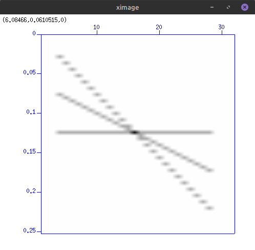
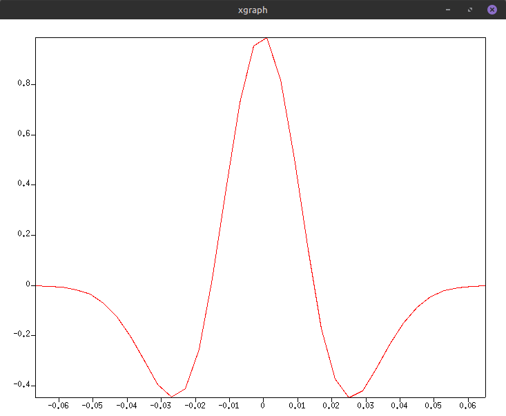

# capitulo 1

**1.** A saída do comando abaixo detalha a função do atributo `scalco`

```bash
sukeyword -o | grep -m 1 -A7 scalco
```

```c
short scalco;   /* Scalar to be applied to the next 4 entries
                    to give the real value. 
                    Scalar = 1, +10, +100, +1000, +10000.
                    If positive, scalar is used as a multiplier,
                    if negative, scalar is used as a divisor.
                    byte# 71-72
                    */
```

**2.** `suplane` é um gerador de dados sintéticos utilizado para criar uma seção de afastamento comum contendo até 3 eventos (reflectores ou "planos") inclinados.

O comando abaixo gera uma seção de afastamento comum com 3 eventos inclinados e a exibe usando `suximage`. O parâmetro `npl` só pode ser definido como 1, 2 ou 3.

```bash
suplane npl=3 | suximage
```


Na figura, o eixo horizontal representa o número do traço (trace number, parâmetro `ntr`) e o eixo vertical representa a amostra temporal (time sample, parâmetro `nt`). O plot mostra as amostras coletadas de 32 traços.

**3.**

```bash
suplane >dado.su
```

Gera um arquivo chamado `dado.su` contendo uma seção de afastamento comum com 3 eventos inclinados.

**4.** 

```bash
surange <dado.su
```

O comando `surange` exibe os valores mínimos e máximos para cada campo do cabeçalho, entre todos os traços de um dado sísmico. 

```
32 traces:
tracl    1 32 (1 - 32)
tracr    1 32 (1 - 32)
offset   400
ns       64
dt       4000
```

Campos do cabeçalho preenchidos:

- `tracl`
- `tracr`
- `offset` é o afastamento dos receptores em relação à fonte, que neste caso é 400 metros.
- `ns` é o número de amostras por traço, que neste caso é 64.
- `dt` é o intervalo de amostragem em microssegundos, que neste caso é 4000 microssegundos (ou 4 milissegundos).

**5.** 

```bash
sushw key=sx,gx a=0,400 b=20,20 <dado.su >dado2.su
```

Nesse comando, as coordenadas horizontais da fonte(`sx`) e do receptor(`gx`) são modificadas, seguindo a seguinte regra:

> As coordenadas `gx` vão começar em 400 metros e aumentar de 20 em 20 metros, enquanto as coordenadas `sx` vão começar em 0 metros e aumentar de 20 em 20 metros.

Vamos usar o comando `sugethw` para verificar os valores de `sx` e `gx` antes e depois da execução do comando `sushw`.

```bash
sugethw key=sx,gx <dado.su
```

```bash
sugethw key=sx,gx <dado2.su
```

**6.** A sísmica de reflexão é sensível a contrastes na densidade e no módulo de Bulk do meio, que por sua vez determinam a **velocidade de propagação** das ondas sísmicas.

**7.** 

```bash
suwaveform type=ricker1 fpeak=15 | suxgraph style=normal
```



Pela figura, $T_D \approx 0.06$ e $T_R \approx 0.04$. Analiticamente, para $f_p = 15$ Hz temos:

$$
T_D = \frac{\sqrt{6}}{\pi f_p} = \frac{\sqrt{6}}{\pi \cdot 15} = 0.05 
$$

$$
T_R = \frac{\sqrt{2}}{\pi f_p} = \frac{\sqrt{2}}{\pi \cdot 15} = 0.03
$$