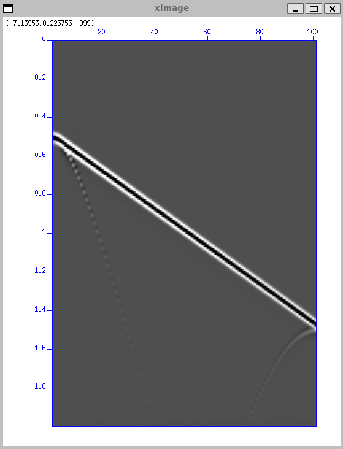

# capitulo 2

**Questão 1**

```bash
susynlv nt=501 dt=0.004 nxo=1 dxo=0 fxo=0 nxs=101 dxs=0.05 fxs=0 fpeak=20 ref="1:0,0.5;5,1.5" >exemplo.su
```

**(a)**

O significado dos parâmetros do comando `susynlv` é:

- `nt = 501` número de amostras no tempo
- `dt = 0.004` intervalo de amostragem no tempo
- `nxo = 1` número de offsets entre a fonte e o receptor
- `dxo = 0` intervalo de amostragem no offset
- `fxo = 0` offset inicial
- `nxs = 101` número de tiros
- `dxs = 0.05` intervalo de amostragem no tiro
- `fxs = 0` tiro inicial
- `fpeak = 20` frequência de pico do sinal
- `ref = "1:0,0.5;5,1.5"` refletores: amplitude:x1,z1;x2,z2;...

O afastamento dos traços é de 0, isso quer dizer que a fonte e o receptor estão no mesmo ponto.

O eixo $x$ representa a distância horizontal ao longo da superfície (offset) e $z$ a profundidade vertical para baixo da superfície.

A extensão do refletor vai do ponto (0, 0.5) até o ponto (5, 1.5), ou seja, o refletor é uma linha inclinada que começa a 0,5 unidades de profundidade e termina a 1,5 unidades de profundidade.

As posições inicial e final de tiro são 0 e 5, respectivamente, com um espaçamento de 0,05 unidades entre cada tiro, totalizando, portanto, 101 tiros (aproximadamente, por que 5/0.05 = 100, mas considerando o tiro inicial, temos 101 tiros).

**(b)**

Exibindo com suximage sem ajuste algum

```bash
suximage <exemplo.su perc=99
```




**(c)**

**(d)**