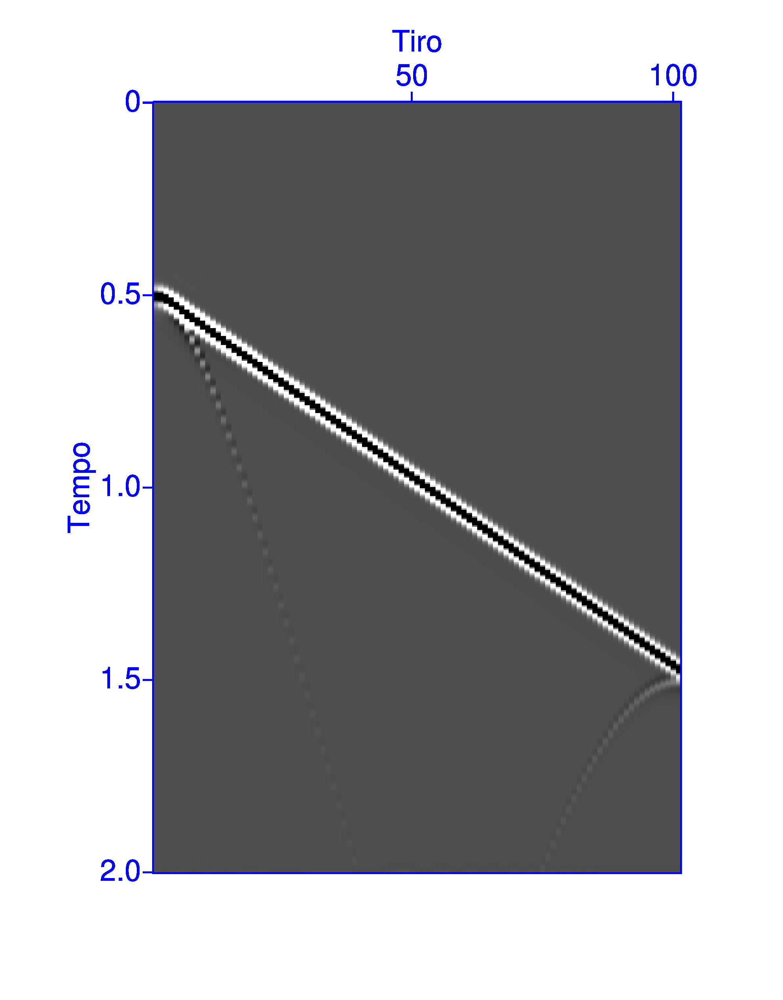
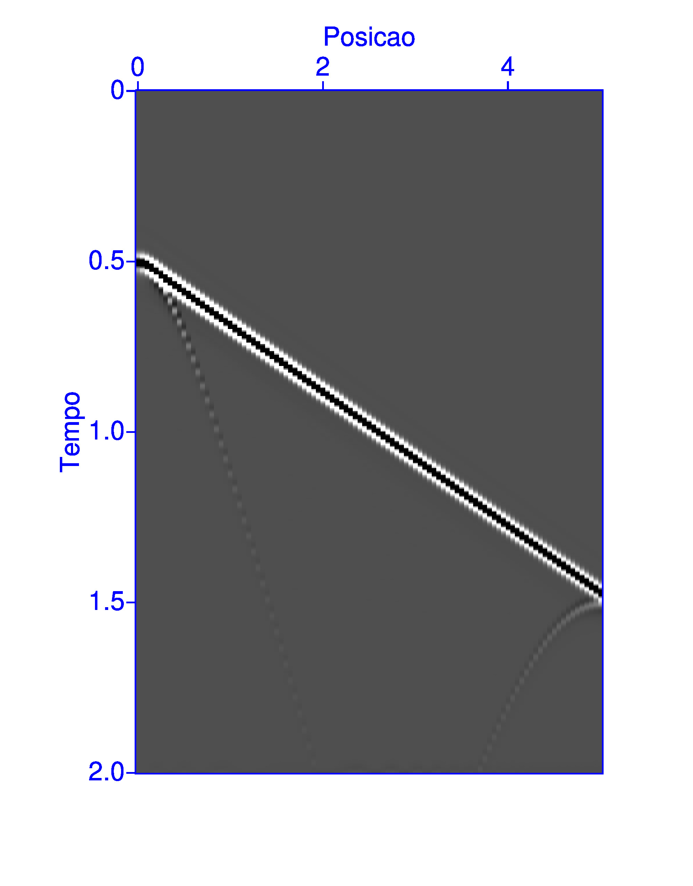
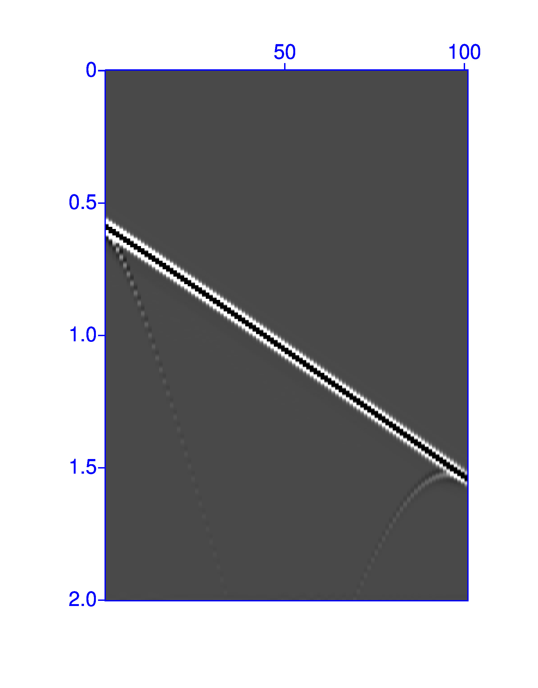
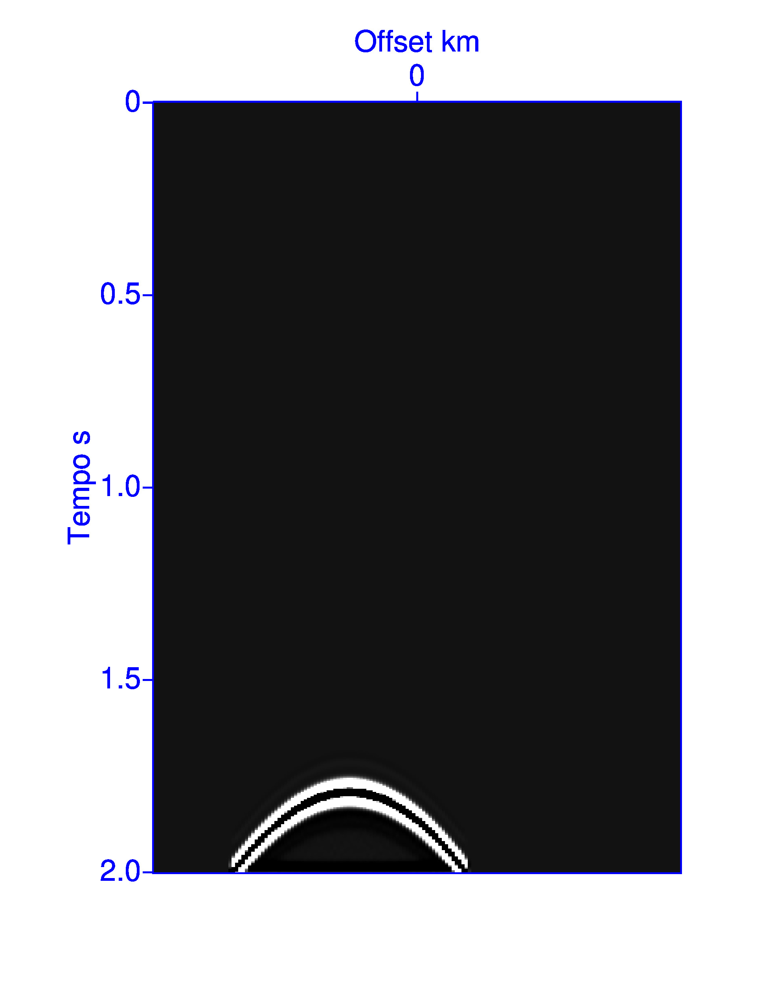
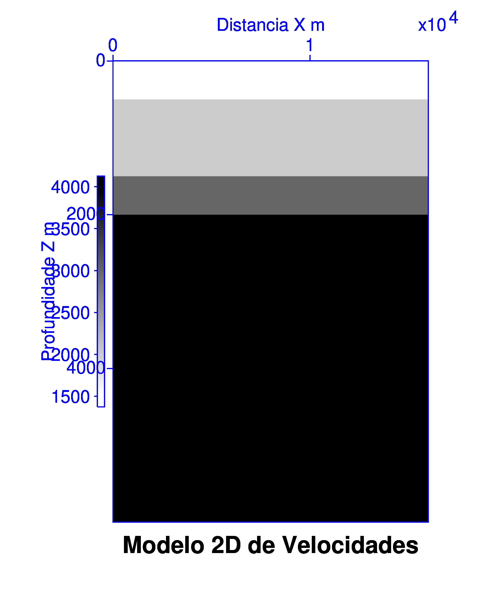

# capitulo 2

**Questão 1**

```bash
susynlv nt=501 dt=0.004 nxo=1 dxo=0 fxo=0 nxs=101 dxs=0.05 fxs=0 fpeak=20 ref="1:0,0.5;5,1.5" >exemplo.su
```

**(a)**

O significado dos parâmetros do comando `susynlv` é:

| Parâmetro | Descrição / Significado |
| :--- | :--- |
| nt = 501 | Número de amostras no tempo |
| dt = 0.004 | Intervalo de amostragem no tempo |
| nxo = 1 | Número de receptores por disparo |
| dxo = 0 | Intervalo de amostragem no *offset* |
| fxo = 0 | Afastamento inicial entre o receptor e a fonte ($x_g - x_s$) |
| nxs = 101 | Número de tiros |
| dxs = 0.05 | Espaçamento entre disparos consecutivos |
| fxs = 0 | Posição do primeiro disparo ($x_s$) |
| fpeak = 20 | Frequência de pico do sinal |
| ref = "1:0,0.5;5,1.5" | Refletores: amplitude: $x_1,z_1; x_2,z_2; \dots$ |

O afastamento dos traços é de 0, isso quer dizer que a fonte e o receptor estão no mesmo ponto.

O eixo $x$ representa a distância horizontal ao longo da superfície (offset). O eixo $z$ representa a profundidade. O eixo $t$ representa o tempo.

A extensão do refletor vai do ponto (0, 0.5) até o ponto (5, 1.5), ou seja, o refletor é uma linha inclinada que começa a 0,5 unidades de profundidade e termina a 1,5 unidades de profundidade.

As posições inicial e final de tiro são 0 e 5, respectivamente, com um espaçamento de 0,05 unidades entre cada tiro, totalizando, portanto, 101 tiros (aproximadamente, por que 5/0.05 = 100, mas considerando o tiro inicial, temos 101 tiros).


**(b)**

Exibindo com suximage sem ajuste algum

```bash
suximage <exemplo.su label2="Tiro" label1="Tempo (s)" perc=99 
```



Os valores padrão dos parâmetros que ajustam a escala do eixo horizontal (dimensão lenta) são `f2 = 0.0` e `d2 = 1.0`. Isso quer dizer que o plot vai exibir o eixo horizontal de 0 a 101, que é o número do tiro, com um espaçamento de 1 unidade entre cada tiro.

Pelo comando susynlv, são 101 tiros para serem apresentados no eixo horizontal. Então, faz sentido que, com `d2 = 1.0`, o eixo horizontal vá de 0 a 101, que é o número do tiro.

$$
(101 \text{ tiros}) \cdot 1.0 = 101
$$

Esse modelo é *zero-offset* então o ponto médio de cada tiro é a própria posição do tiro, em que fonte $x_s$ e receptor $x_g$ estão no mesmo ponto. Assim, para que cada tiro coincida com seu ponto médio, precisamos ajustar o parâmetro `d2` para 0.05, que é o espaçamento entre os tiros. Assim, o eixo horizontal representará a posição do tiro.

$$
(101 \text{ tiros}) \cdot 0.05 = 5.05 \text{ km}
$$

```bash
suximage f2=0.0 d2=0.05 label2="Ponto Medio (km)" label1="Tempo (s)" <exemplo.su perc=99
```



**(c)** Para que todos os traços tenham afastamento de 500m da fonte, ou seja, um common-offset de 500m, precisamos ajustar o parâmetro `fxo` para 0.5 (em km), que é a posição do receptor em relação à fonte. Assim, o afastamento entre a fonte e o receptor será de 500m.

```bash
susynlv nt=501 dt=0.004 nxo=1 dxo=0 fxo=0.5 nxs=101 dxs=0.05 fxs=0 fpeak=20 ref="1:0,0.5;5,1.5"
```



Como os receptores estão mais longe da fonte, visivelmente a partir do instante 0.5 segundos temos uma perda de parte da energia do sinal (observe que não temos mais o ponto de "queda" da onda refletida, quando comparado com a imagem da seção anterior), e um atraso no tempo de chegada do sinal refletido, que é esperado, já que o caminho percorrido pelo sinal é maior.

**(d)**

```bash
susynlv nt=501 dt=0.004 nxo=1 dxo=0 fxo=0.5 nxs=101 dxs=0.05 fxs=0 fpeak=20 ref="1:0,0.5;5,1.5" | sugethw key=sx,gx,offset | head
```

Abaixo as primeiras linhas do resultado do comando acima:

```bash
sx=0            gx=500      offset=500

sx=50           gx=550      offset=500

sx=100          gx=600      offset=500

sx=150          gx=650      offset=500

sx=200          gx=700      offset=500
```

Observe que a fonte se move a cada tiro: quando ela está em 0, o receptor está em 500, quando a fonte está em 50, o receptor está em 550, e assim por diante. O afastamento entre a fonte e o receptor é sempre de 500m.

**Questão 2**

Simulação de uma seção com as características abaixo

- Tiro comum (nxs = 1)
- Modelo com um refletor plano inclinado, com mergulho de 30 graus
- Afastamentos de -4km a 4km
- A profundade mínima do refletor deve ser de 500m (0.5 km)

Considerando que temos um receptor a cada dxs = 0.05 km, o número de receptores será

$$
\text{nxo} = \frac{4 - (-4)}{0.05} + 1 = 161
$$

```bash
susynlv nt=501 dt=0.004 nxs=1 fxs=0 dxs=0 fxo=-4.0 dxo=0.05 nxo=161 fpeak=20 ref="1:-5,0.5;5,3.38" | suximage label1="Tempo (s)" label2="Offset (km)" perc=99
```



Essa seção é chamada de *common-shot* (tiro comum), pois temos apenas um tiro, e todos os receptores estão localizados em torno da posição do tiro.

**Questão 3**

**(a)**

O modelo de velocidades gerado para essa questão foi gerado em [modelo_velocidades_2d.m](./modelo_velocidades_2d.m)


